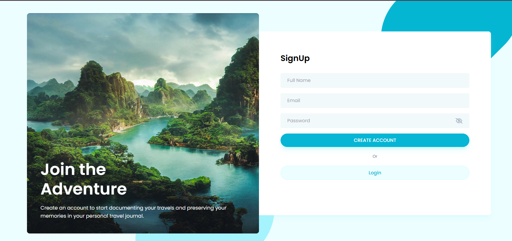
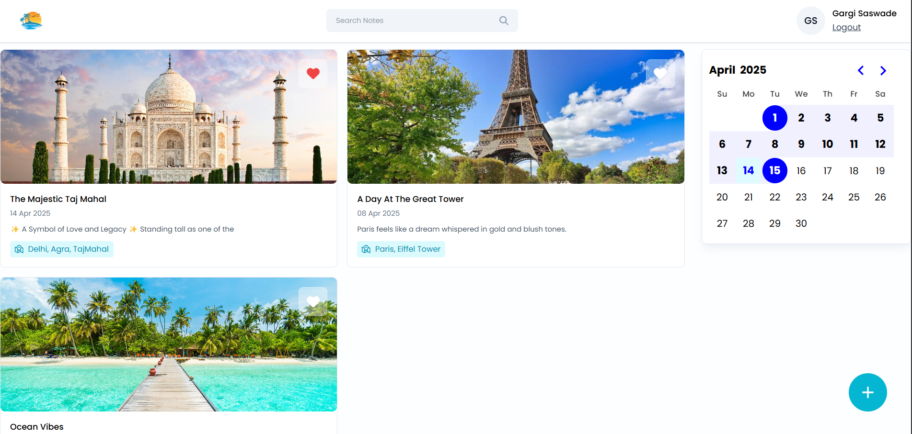
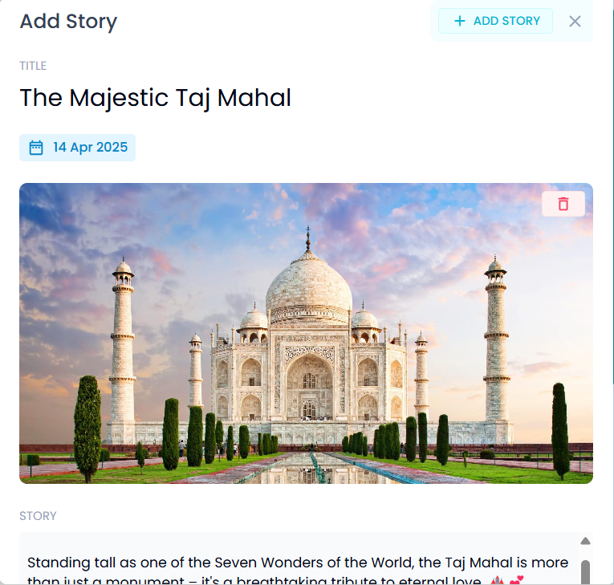
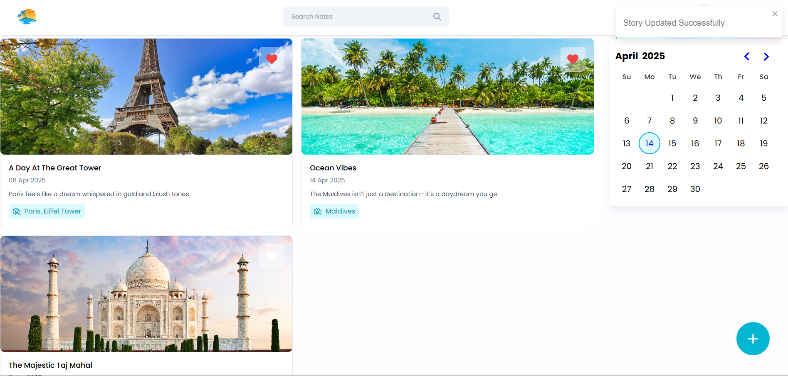
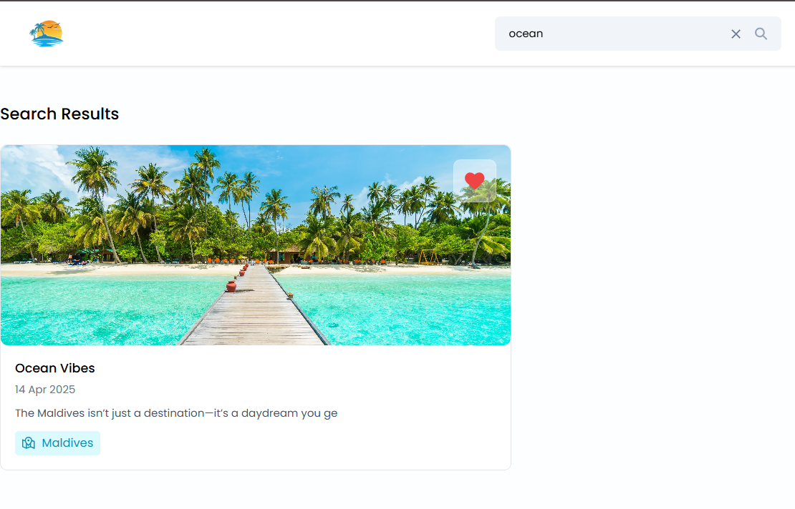
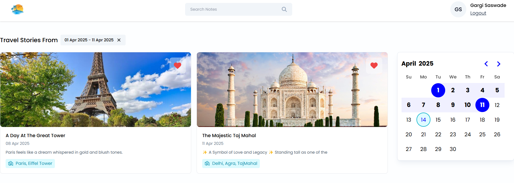
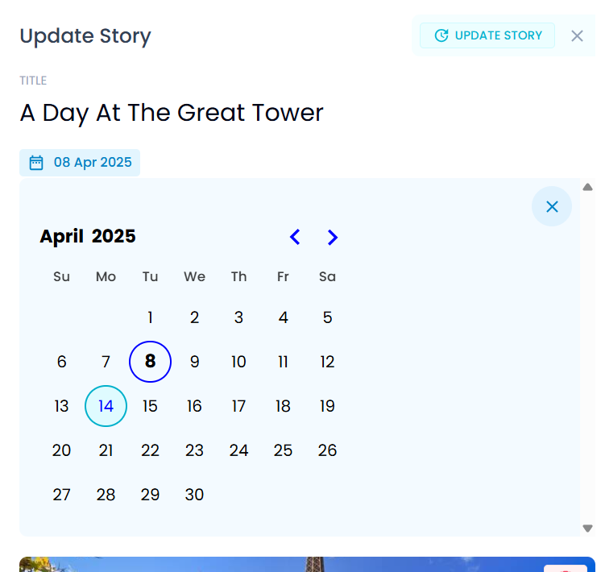
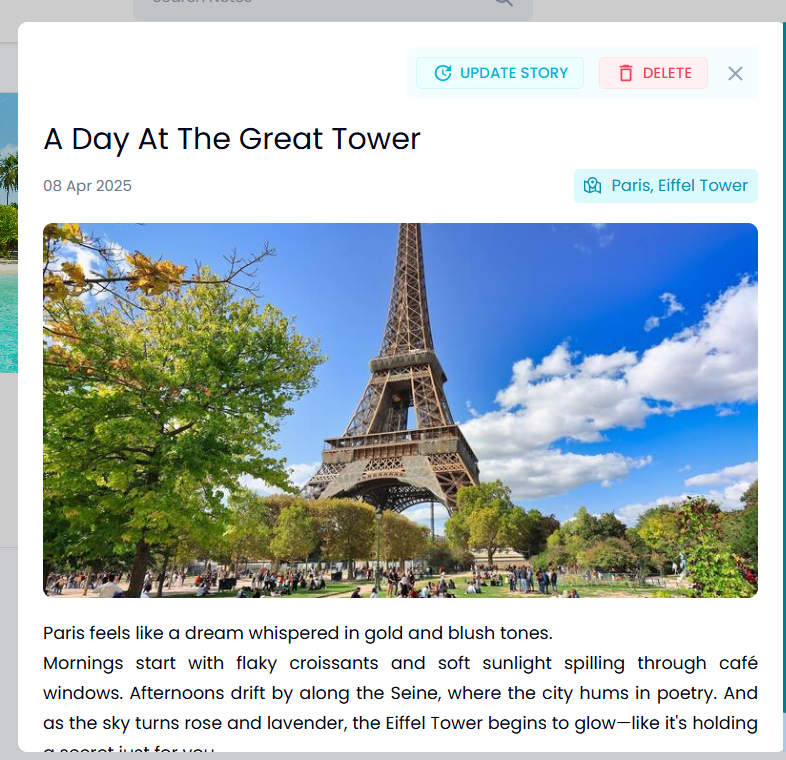

🌍 Travel Diary
**Travel Diary** is a full-stack MERN application that allows users to document and manage their travel experiences through beautifully structured stories. With a secure authentication system, image uploads, story filtering, and search functionality, this app offers a smooth and personalized journaling experience for travelers who want to preserve their memories digitally.

The backend is built with Node.js, Express, and MongoDB, while authentication is handled using JSON Web Tokens (JWT) and password encryption with bcrypt. Users can register, log in, and perform full CRUD operations on their travel stories. Each story contains details such as a title, story content, location visited, date of the visit, and an optional image. The app also supports uploading images using `multer`, and includes functionality to delete images from the server's file system when stories are removed.

One of the key features is the ability to mark stories as favorites, making it easier to find the most meaningful experiences. In addition to this, users can search through their stories by title, description, or location using a case-insensitive search feature. There is also a date range filter that helps in narrowing down travel experiences within a specific timeframe.

The API is protected using middleware that checks for valid JWT tokens before granting access to private routes. All user-specific data is isolated based on the logged-in user's ID, ensuring privacy and secure access.

To get started, clone the repository and run `npm install` to install the dependencies. You'll need to create a `.env` file in the root directory and provide values for `ACCESS_TOKEN_SECRET` and `MONGODB_URI`. Once set up, you can start the development server with `node index.js`. Make sure the frontend (React or any client you're using) is configured to interact with the API endpoints correctly.

Screenshots of the application’s core features are provided below to give you a quick preview of what the UI looks like in action.

🛠️ Tech Stack

Backend: Node.js, Express, MongoDB, Mongoose

Auth: JWT, bcrypt

File Upload: Multer, File System

Frontend: React (Not included in this repo if it's backend-only)

Other: dotenv, CORS, ES Modules

## 📸 Screenshots

### 👤 Signup Page

### 🔑 Login Page

### 🏠  All Stories

### ➕ Add New Story

### ❤️ Favorites

### 🔍 Search Stories

### 📅 Filter by Date Range

### ✏️ Update Story

### 🗑️ Delete Story

